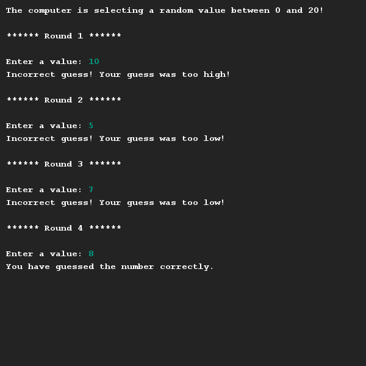

# Number guessing game
## Difficulty:    

Create your own version of the number guessing game as demonstrated in this [video](https://youtu.be/UUmuocVLgBQ). 

Obviously you are allowed to make your own (minor) adjustments like the texts and values, as long as the functionality (random number generation, rounds, feedback on a guess, being able to guess correctly) is there.

## Example

## Relevant links
* [Java documentation of the SaxionApp](https://saxionapp.hboictlab.nl/nl/saxion/app/SaxionApp.html)
* [Video to exercise](https://youtu.be/UUmuocVLgBQ)
