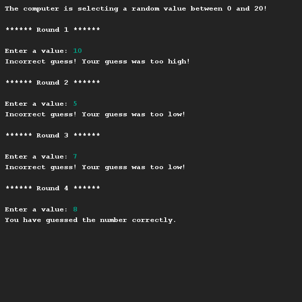

# Hoger Lager
## Moeilijkheid:    

Schrijf je eigen versie van het "hoger-lager" spel zoals gedemonstreerd in deze [video](https://youtu.be/BsPkGdMHurE). 

Je mag uiteraard zelf je eigen teksten kiezen en bepalen tussen welke waarden een getal moet worden geraden, zolang de essentie van het spel (random getal generatie, feedback op pogingen, ronden, de mogelijkheid om het goed te hebben), maar aanwezig zijn.

## Voorbeeld

## Relevante links
* [Java documentatie van de SaxionApp](https://saxionapp.hboictlab.nl/nl/saxion/app/SaxionApp.html)
* [Opdrachtvideo](https://youtu.be/BsPkGdMHurE)

