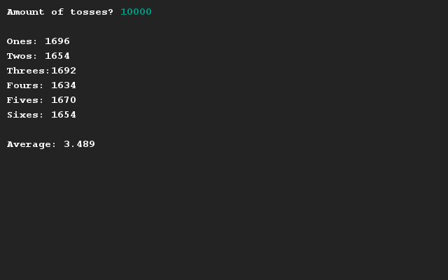

# Checking a die simulation
## Difficulty:    

Create a program in which you'll simulate a certain amount of die tosses, and generate some statistics about all these simulations. The amount of tosses must be entered by the user, after which each individual toss is registered.

At the end, an overview of the amount of "ones", "twos", "threes", etc. is shown, as well as the weighted average. 

## Example

## Relevant links
* [Java documentation of the SaxionApp](https://saxionapp.hboictlab.nl/nl/saxion/app/SaxionApp.html)
