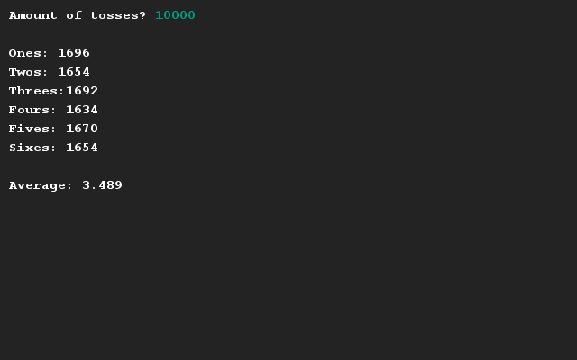

# De dobbelsteen simulator controleren
## Moeilijkheid:    

Schrijf een programma waarin je een willekeurige hoeveelheid dobbelsteenworpen laat uitvoeren en deze analyseert. Het aantal worpen moet worden kunnen ingevoerd door de gebruiker, waarna een kleine analyse wordt uitgevoerd op de resultaten.

De analyse bestaat uit het bijhouden van het aantal "enen", "tweeen", "drieen", etc. wat wordt geworpen, plus de berekening van het (gewogen) gemiddelde van alle worpen.

## Voorbeeld

## Relevante links
* [Java documentatie van de SaxionApp](https://saxionapp.hboictlab.nl/nl/saxion/app/SaxionApp.html)

