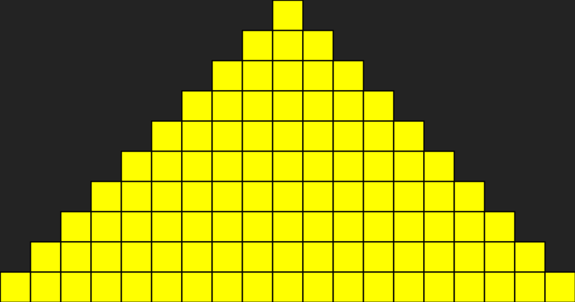

# Een volledige pyramide tekenen
## Moeilijkheid:    

Schrijf een programma waarin je een volledige pyramide kan tekenen, gebaseerd op een of andere vooraf gedefinieerde hoogte. Deze hoogte hoeft niet door de gebruiker ingevoerd te worden en mag dus _hard coded_ worden. 

Naast het printen van de pyramide is het belangrijk dat het scherm precies op maat wordt gemaakt voor de pyramide. We willen dus zo min mogelijk ruimte om de pyramide heen hebben en hiervoor zal je het schermen moeten _resizen_. Dit is ook een onderdeel van de opdracht.

Je mag (om het iets makkelijker te maken) de "statusbalk" buiten beschouwing laten en hoef je dus niet mee te rekenen. (Dit mag uiteraard wel!)

## Voorbeeld

## Relevante links
* [Java documentatie van de SaxionApp](https://saxionapp.hboictlab.nl/nl/saxion/app/SaxionApp.html)
