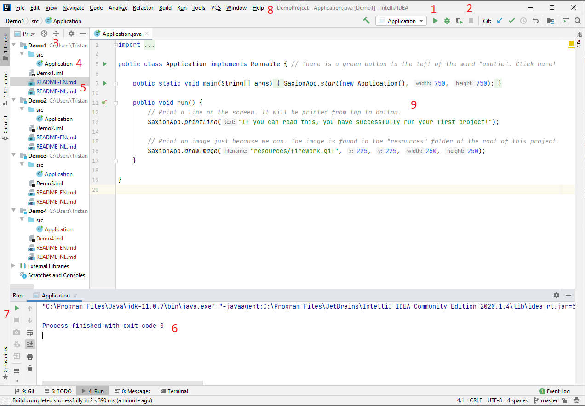

# Je allereerste applicatie!
## Moeilijkheid:    

In dit programma hoef je zelf eigenlijk niets te doen, behalve het te starten!... En kijk eens naar hoe je het programma weer kan sluiten.

Bekijk vervolgens de onderstaande afbeelding. Als het goed is ziet dit scherm er (ongeveer) net zo uit als jouw scherm. In de afbeelding staan de getallen 1 t/m 9 genummerd op plekken waar je regelmatig iets gaat doen. Klik / Bekijk deze plekken eens goed en ga voor jezelf na wat je nu eigenlijk ziet.. Kan jij uitleggen wat je ziet bij de nummers?

Vul dit hieronder in!
1) Importeren van packages
2)
3)
4) 
5)
6)
7)
8)
9)

## Relevante links
* [Java documentatie van de SaxionApp](https://saxionapp.hboictlab.nl/nl/saxion/app/SaxionApp.html)