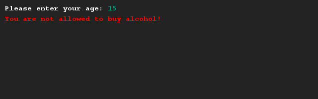

# Ben je oud genoeg?
## Moeilijkheid:   

Schrijf een programma waarmee bareigenaren kunnen controleren of iemand al oud genoeg is om alcohol te kopen. In Nederland ben je oud genoeg om alcohol te kopen als je 18 jaar bent of ouder.

Gebruik kleur in je applicatie om aan te geven of iemand alcohol kan kopen of niet.

## Voorbeeld

## Relevante links
* [Java documentatie van de SaxionApp](https://saxionapp.hboictlab.nl/nl/saxion/app/SaxionApp.html)

