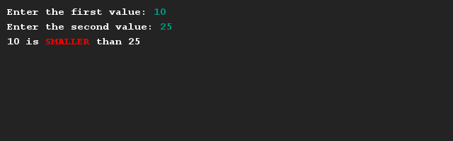
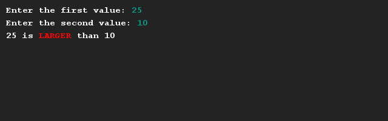
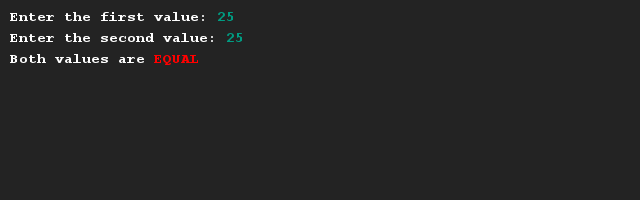

# Waarden vergelijken
## Moeilijkheid:    

Schrijf een programma waarmee je twee waarden kan invoeren. Vervolgens bepaalt de computer hoe deze twee waarden aan elkaar gerelateerd zijn.

## Voorbeeld

## Relevante links
* [Java documentatie van de SaxionApp](https://saxionapp.hboictlab.nl/nl/saxion/app/SaxionApp.html)

