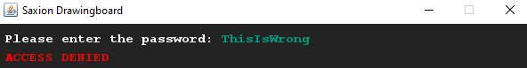
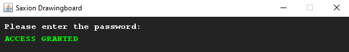

# Simple password check
## Difficulty:    

Create a password that unlocks a (empty) vault based on some password. You should hardcode the password in your application.

Next, change the color of the input String to the same color as the background (see example_output_3 below) so you can't read the password while typing it. (Note: This isn't how real security works, but good enough for now!)

## Example

## Relevant links
* [Java documentation of the SaxionApp](https://saxionapp.hboictlab.nl/nl/saxion/app/SaxionApp.html)

