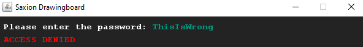
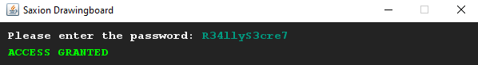
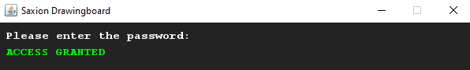

# Eenvoudige wachtwoord controle
## Moeilijkheid:    

Schrijf een programma waarin een of andere (lege) kluis wordt beveiligd met een wachtwoord. Het wachtwoord moet je in je code opnemen (en hoeft dus niet uitgevraagd te worden). 

Zodra dit werkt, wijzig de invoerkleur van de String (wachtwoordveld) zodat deze overeenkomt met de achtergrond. Op deze manier kan het wachtwoord niet gelezen worden tijdens het intypen. (Let op: Dit is uiteraard niet hoe echte beveiliging werkt, maar voor nu is het goed genoeg!)

## Voorbeeld

## Relevante links
* [Java documentatie van de SaxionApp](https://saxionapp.hboictlab.nl/nl/saxion/app/SaxionApp.html)

