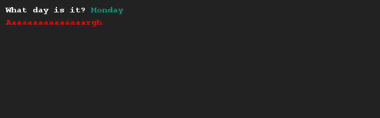
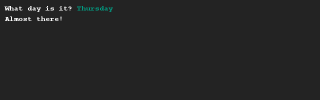

# Motto van de dag
## Moeilijkheid:    

Schrijf een programma waarmee je het motto van de dag kan bepalen. Deze motto's zijn gekoppeld aan dagen en mag je zelf verzinnen. Het gaat er om dat de computer op basis van een ingevulde dag kan zeggen welk motto hier bij hoort. Wees creatief en gebruik kleuren om aan te geven hoe jouw week er uit ziet.

## Voorbeeld

## Relevante links
* [Java documentatie van de SaxionApp](https://saxionapp.hboictlab.nl/nl/saxion/app/SaxionApp.html)

