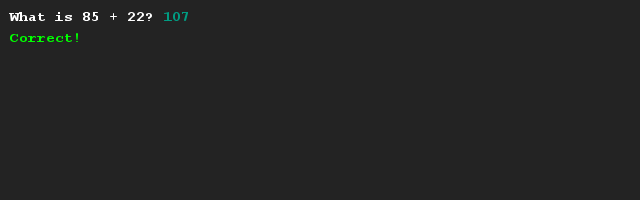
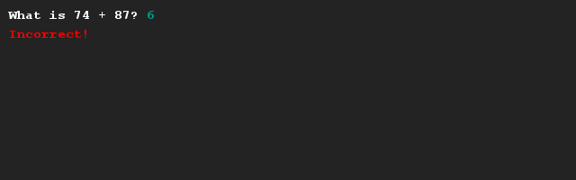

# Calculus trainer
## Difficulty:    

Create a program that helps someone to train their math skills. The computer will generate two random integers (you can use the SaxionApp for that) that are added and compared to input of the user. Obviously, the result of the question (whether is it correct or incorrect) is displayed.

## Example

## Relevant links
* [Java documentation of the SaxionApp](https://saxionapp.hboictlab.nl/nl/saxion/app/SaxionApp.html)