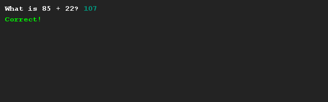

# Oefenen met rekenen 
## Moeilijkheid:    

Schrijf een programma om (hoofd)rekenen mee te oefenen. Het programma werkt door 2 willekeurige getallen te bepalen (doe dit m.b.v. de SaxionApp) en deze bij elkaar op te tellen. Dit antwoord wordt vervolgens vergeleken met de invoer van de gebruiker. Het resultaat (of het antwoord goed is of niet) wordt vervolgens getoond in het scherm.

## Voorbeeld

## Relevante links
* [Java documentatie van de SaxionApp](https://saxionapp.hboictlab.nl/nl/saxion/app/SaxionApp.html)

