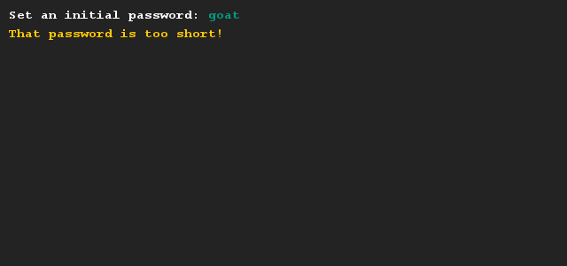
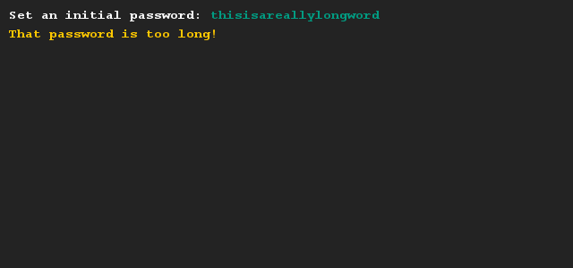
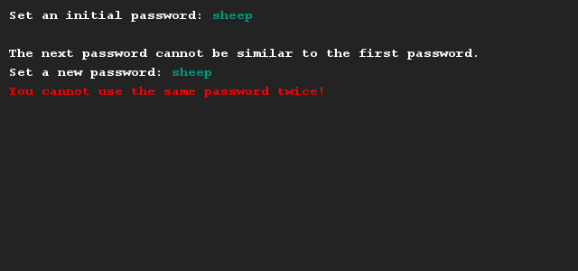

# Password creation
## Difficulty:    

Create a program that allows the user to set an initial password. After the first password is set, the system immediately prompts for a second password (to simulate a password change). This password cannot be the same as the first password.

To make the exercise a little more interesting, we have also included two restrictions to the first password. First, the password should have a minimum length of 5 characters. Secondly, the password cannot be longer than 20 characters. You'll need the official String API documentation to know how to check the length of any String variable. You can find this documentation [here](https://docs.oracle.com/javase/9/docs/api/java/lang/String.html).

These restrictions do not apply to the second password (for convenience). 

## Example

## Relevant links
* [Java documentation of the SaxionApp](https://saxionapp.hboictlab.nl/nl/saxion/app/SaxionApp.html)
* [Java documentation of the String class](https://docs.oracle.com/javase/9/docs/api/java/lang/String.html)