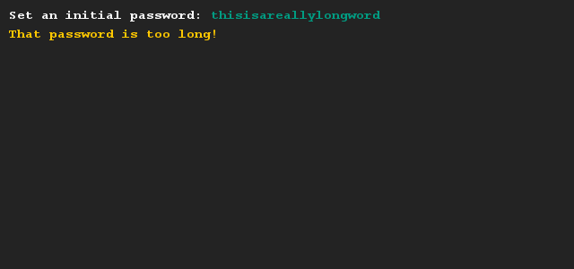
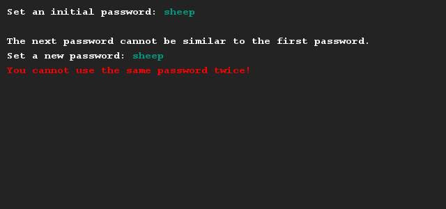
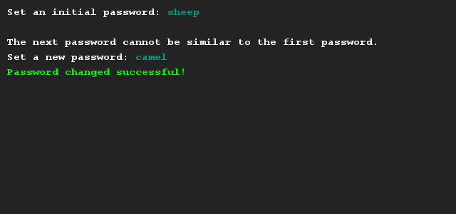

# Opslaan van wachtwoorden
## Moeilijkheid:    

Schrijf een programma waarmee een gebruiker een wachtwoord kan instellen. Nadat dit wachtwoord is ingesteld zal de computer gelijk om een nieuw wachtwoord vragen om het eerste wachtwoord te overschrijven (hiermee simuleren we dat je je wachtwoord moet updaten). Het tweede wachtwoord moet uiteraard anders zijn dan je eerste wachtwoord.

Om de opdracht daarbij nog iets interessanter te maken hebben we de volgende twee eisen erbij gesteld. Het eerste wachtwoord mag niet korter zijn dan 5 tekens of langer zijn dan 20 tekens. Voor ons gemak zijn deze regels niet van toepassing op het tweede wachtwoord.

Je hebt de API documentatie van de String klasse nodig om te weten hoe lang het wachtwoord is. Kijk [hier](https://docs.oracle.com/javase/9/docs/api/java/lang/String.html) voor deze documentatie.

## Voorbeeld

## Relevante links
* [Java documentatie van de SaxionApp](https://saxionapp.hboictlab.nl/nl/saxion/app/SaxionApp.html)
* [Java documentatie van de String klasse](https://docs.oracle.com/javase/9/docs/api/java/lang/String.html)

