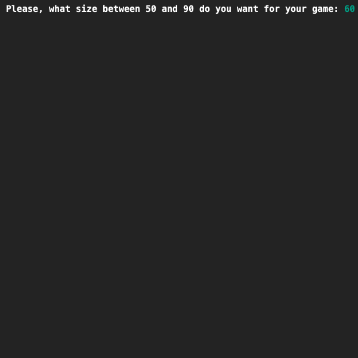
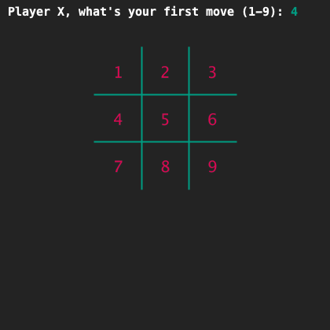
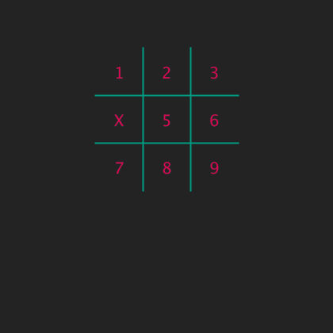

# TicTacToe using input
## Difficulty:    

Now it's getting serious with TicTacToe (nought and crosses)
You now have a board where the value of each of the 9 fields is stored in a separate variable.
The size of the board is variable and the user can determine the size.
The next step is to let the users (the players) make the moves.

You can use your own code or start from the example code provided with the last exercise.

Create a program that performs the following steps:
1. The player is asked what size the board should have. There is a minimum and maximum value.
2. When the player enters a value that is not within range (min-max), then the value is changed into something that is within range.
3. The value is used to display the game board with all field numbers
4. Player X is asked to make the first move.
5. If the player entered a value betwee 1 and 9, an update of the board is shown with this one move. All other fields show a number.
6. If the player entered something else, a message is shown and the board is printed without any changes.

You now have a lot of code twice in the file. That can be done more efficiently with loops. And that's why we leave it at this first move. We'll continue later.

## Example

## Relevant links
* [Java documentation of the SaxionApp](https://saxionapp.hboictlab.nl/nl/saxion/app/SaxionApp.html)