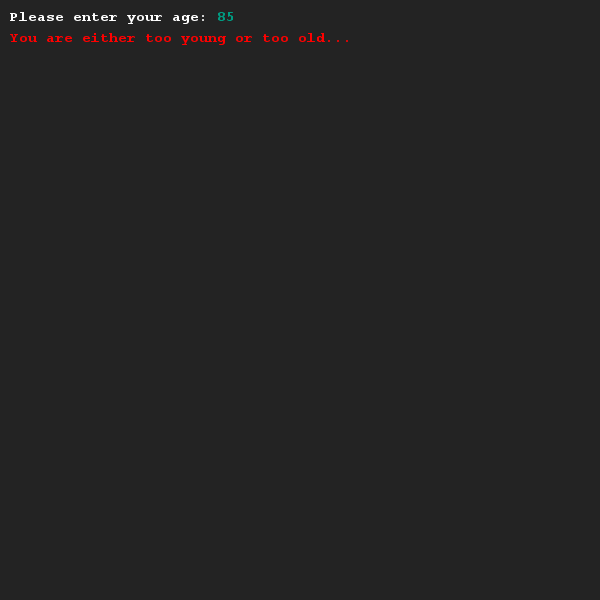
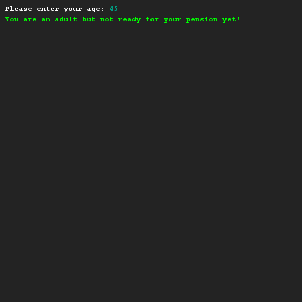

# Adults and their pension
## Difficulty:    

Create a program that determines whether or not someone that enters their age is an adult (18+) AND not ready for their pension (67-).
Make sure to use one if statement that uses the AND operator.

Use color in your application to illustrate whether or not someone meets the requirements.

## Example

## Relevant links
* [Java documentation of the SaxionApp](https://saxionapp.hboictlab.nl/nl/saxion/app/SaxionApp.html)

