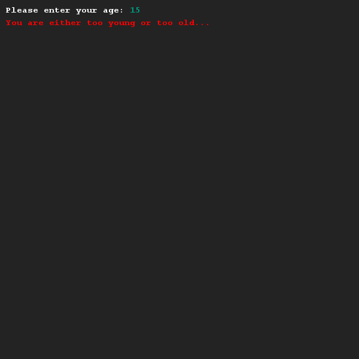
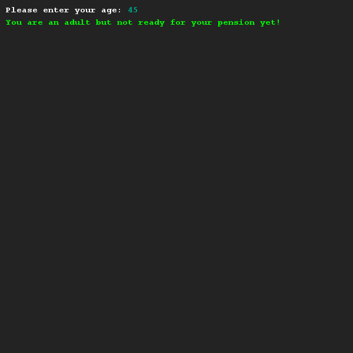

# Volwassenen en hun pensioen
## Moeilijkheid:    

Maak een programma dat kijkt of iemand volwassen (18+) is EN nog te jong is om met pensioen te gaan (67-).
Zorg dat je slechts 1 if-statement gebruikt, waarbij je gebruik maakt van de AND operator.

Gebruik kleur in je applicatie om te illustreren of iemand voldoet aan de eisen.

## Voorbeeld

## Relevante links
* [Java documentatie van de SaxionApp](https://saxionapp.hboictlab.nl/nl/saxion/app/SaxionApp.html)
