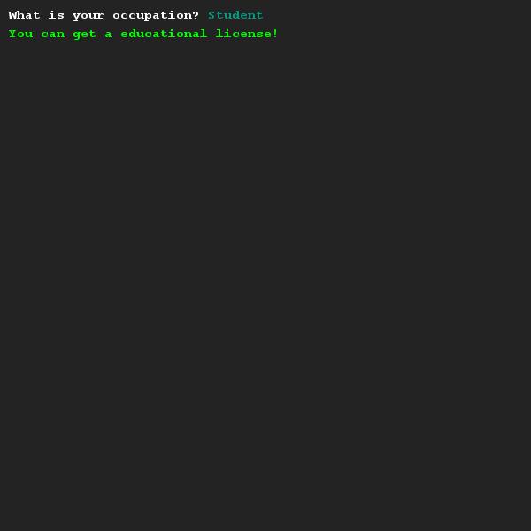
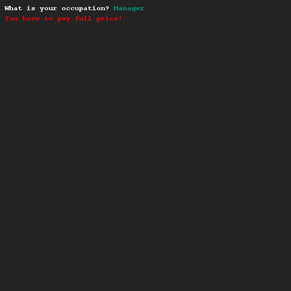

# Code herschrijven met boolean logic 1
## Moeilijkheid:    

Kopieer de code hieronder en plak dit in de oefening. Kijk wat het programma doet als je het runt.
```Java
SaxionApp.print("What is your occupation? ");
String occupation = SaxionApp.readString();

if (occupation.equals("Teacher")) {
    SaxionApp.printLine("You can get a educational license!", Color.GREEN);
} else if (occupation.equals("Student")) {
    SaxionApp.printLine("You can get a educational license!", Color.GREEN);
} else {
    SaxionApp.printLine("You have to pay full price!", Color.RED);
}
```
Het valt je misschien op dat de code een "duplicate line" (dubbele regel) heeft. Tijdens het programmeren proberen we duplicate lines zoveel mogelijk te voorkomen.

Zorg dat de duplicate line uit het programma gehaald wordt door het gebruik van boolean logic. Let op dat je programma precies doet wat het voorbeeld programma doet!

## Voorbeeld




## Relevante links
* [Java documentatie van de SaxionApp](https://saxionapp.hboictlab.nl/nl/saxion/app/SaxionApp.html)
