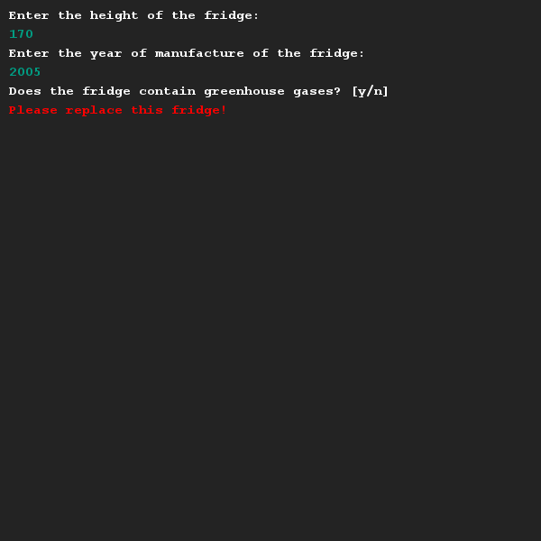
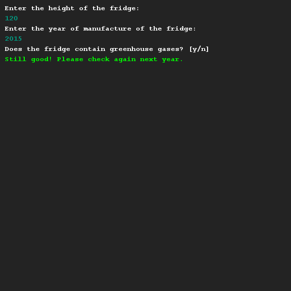

# Replace your fridge
## Moeilijkheid:    

To try to tackle the environmental issues, the Dutch government issues grants to citizens that replace their old fridge. If a fridge is taller than 150cm and the year of manufacture is 2010 or earlier, the citizen can use this grand. Additionally, if the fridge does not meet the requirements but contains dangerous greenhouse gases, a citizen can use the grant.

Write a program that displays a message to the user whether or not he or she can use the grant. Use boolean logic in your implementation.

## Example

## Relevant links
* [Java documentation of the SaxionApp](https://saxionapp.hboictlab.nl/nl/saxion/app/SaxionApp.html)