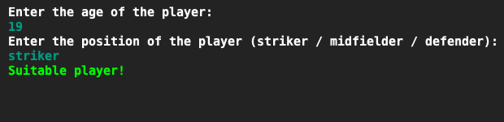
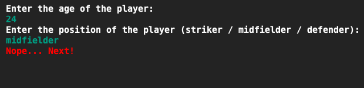

# Football scout
## Moeilijkheid:    

A local soccer team tries to improve its way of scouting and asks for your help with writing a program for that. The program must display a message whether or not the player is suitable for the team.

The team is looking for midfielders and strikers that are still young so they can adapt to the playstyle of the team. However, the team has issues with defending so they are looking for experienced defenders.

A player is suitable if:
- The player is a striker and at tops 20 years old.
- The player is a midfielder and at tops 23 years old.
- The player is a defender and at least 30 years old.

Use boolean logic for this assignment (hint: Use just one if-statement!)

## Example

## Relevant links
* [Java documentation of the SaxionApp](https://saxionapp.hboictlab.nl/nl/saxion/app/SaxionApp.html)