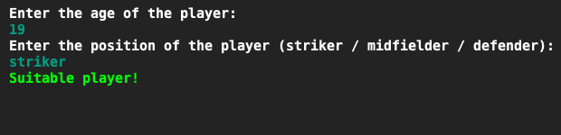
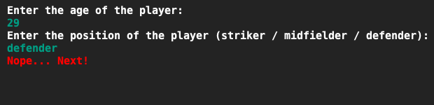
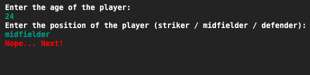

# Voetbal scout
## Moeilijkheid:    

Een plaatselijke voetbalclub probeert zijn manier van scouten te verbeteren en vraagt jou om een programma te schrijven om daarbij te helpen. Het programma moet een melding geven met of de speler geschikt is of niet.

Het team is op zoek naar middenvelders en aanvallers die nog jong genoeg zijn om hun spel aan te kunnnen passen naar de speelstijl van het team. Echter heeft het team een probleem achterin en zoekt het team dus ook ervaren verdedigers.

Een speler is geschikt als:
- De speler een aanvaller is van maximaal 20 jaar.
- De speler een middenvelder is van maximaal 23 jaar.
- De speler een verdediger is van minimaal 30 jaar.

Maak bij deze opdracht gebruik van boolean logic (tip: Gebruik 1 if-statement!)

## Voorbeeld

## Relevante links
* [Java documentatie van de SaxionApp](https://saxionapp.hboictlab.nl/nl/saxion/app/SaxionApp.html)
