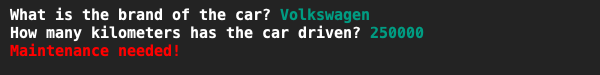

# Car Maintenance Checker
## Difficulty:    

A local car dealer wants an application that checks whether or not a car needs maintenance by entering the car brand name and the number of kilometers the car traveled. If a car has traveled over 100.000km, maintenance is needed.

The car dealer is a big fan of Volvo cars because they are the most stable cars around. They do not need maintenance at all! So make sure that, when the car is a Volvo, the system will display that no maintenance is needed, even when the number of driven kilometers is over the maintenance limit.

Make sure to use one if statement that uses the OR operator.

Use color in your application to illustrate whether or not maintenance is needed.

## Example

## Relevant links
* [Java documentation of the SaxionApp](https://saxionapp.hboictlab.nl/nl/saxion/app/SaxionApp.html)