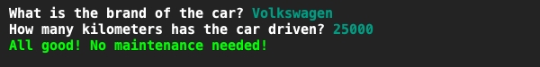
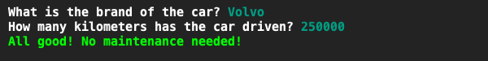
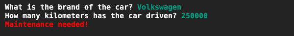

# Auto-onderhoud checker
## Moeilijkheid:    

Een lokale autogarage wil graag een applicatie die bepaalt of een auto onderhoud nodig heeft. Dit gebeurt door het invullen van het merk van de auto en hoeveel kilometer de auto gereden heeft. Als de auto meer dan 100.000km gereden heeft, is er onderhoud nodig.

De autogarage is een grote fan van Volvo omdat Volvos erg robuust zijn. Ze hebben nanelijk totaal geen onderhoud nodig! Dus zorg dat je programma, wanneer er ingevuld is dat het een Volvo betreft, weergeeft dat de auto geen onderhoud nodig heeft (zelfs als de auto meer dan de onderhoudslimit gereden heeft!).

Zorg dat je slechts 1 if-statement gebruikt, waarbij je gebruik maakt van de OR operator.

Gebruik kleur in je applicatie om te illustreren of onderhoud nodig is.

## Voorbeeld

## Relevante links
* [Java documentatie van de SaxionApp](https://saxionapp.hboictlab.nl/nl/saxion/app/SaxionApp.html)
