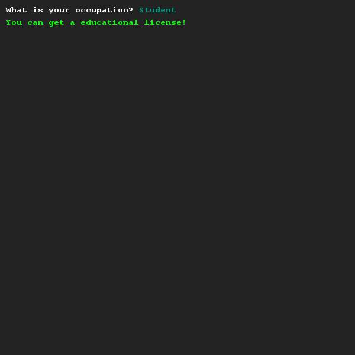
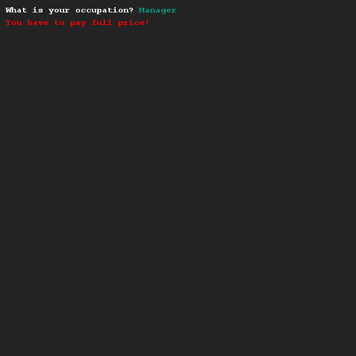

# Rewrite using boolean logic 1
## Difficulty:    

Copy the code below into the exercise and see what it does by testing around with it.
```Java
SaxionApp.print("What is your occupation? ");
String occupation = SaxionApp.readString();

if (occupation.equals("Teacher")) {
    SaxionApp.printLine("You can get a educational license!", Color.GREEN);
} else if (occupation.equals("Student")) {
    SaxionApp.printLine("You can get a educational license!", Color.GREEN);
} else {
    SaxionApp.printLine("You have to pay full price!", Color.RED);
}
```

You might have noticed this code has a duplicate line. When programming, we try to limit the amount of duplicate lines we write.

Make sure that the duplicate line is removed by using boolean logic and make sure your code acts the exact same.

## Example




## Relevant links
* [Java documentation of the SaxionApp](https://saxionapp.hboictlab.nl/nl/saxion/app/SaxionApp.html)