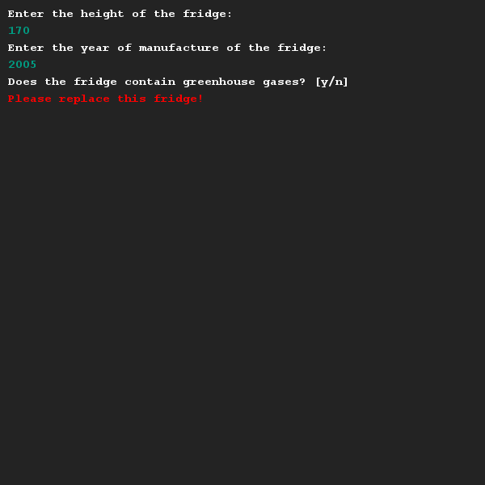
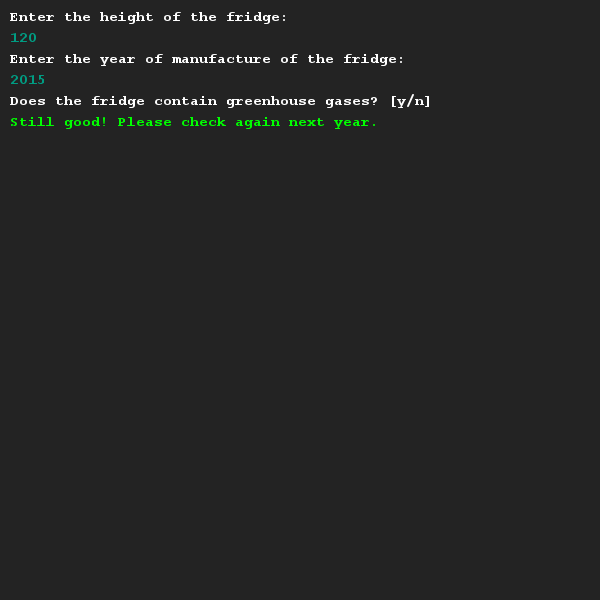

# Koelkast vervangen
## Moeilijkheid:    

Om het milieuprobleem aan te pakken geeft de Nederlandse overheid een subsitie uit voor mensen die hun oude koelkasten laten vervangen.
Als een koelkast hoger is dan 150cm en het bouwjaar 2010 of eerder is, kan je gebruikmaken van deze subsidie. Ook als je koelkast niet voldoet aan deze eisen maar nog gevaarlijke broeikasgassen bevat, kan je gebruikmaken van de subsidie.

Schrijf een programma dat de gebruiker toont of de gebruiker wel of geen gebruik kan maken van de subsidie. Gebruik bij je uitwerking boolean logic.

## Voorbeeld

## Relevante links
* [Java documentatie van de SaxionApp](https://saxionapp.hboictlab.nl/nl/saxion/app/SaxionApp.html)
