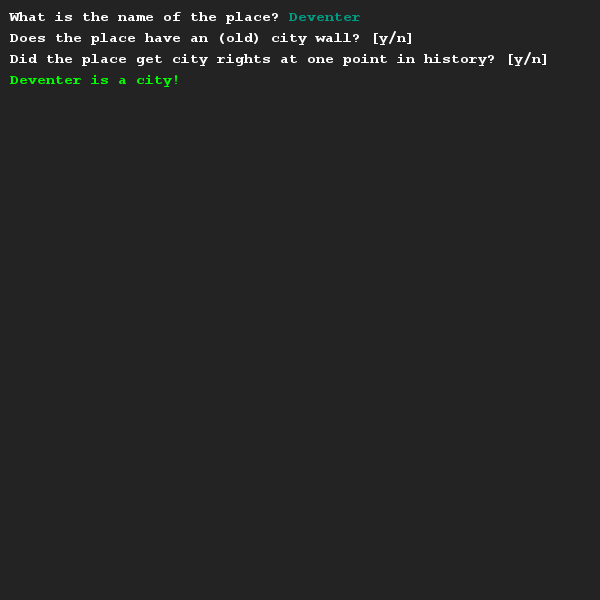
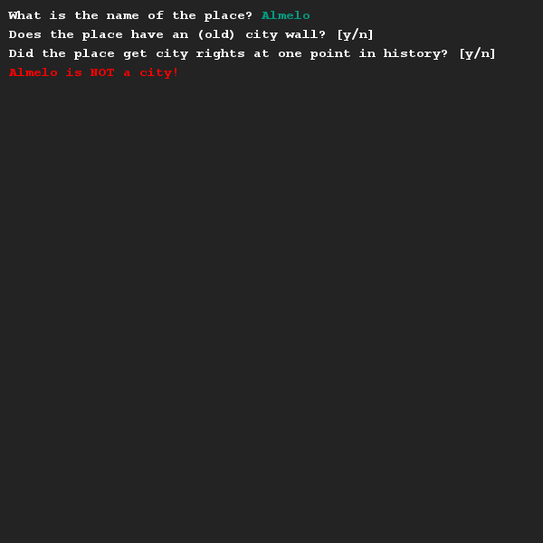

# Rewrite using boolean logic 2
## Difficulty:    

Copy the code below into the exercise and see what it does by testing around with it.
```Java
SaxionApp.print("What is the name of the place? ");
String name = SaxionApp.readString();

SaxionApp.printLine("Does the place have an (old) city wall? [y/n] ");
boolean hasCityWall = SaxionApp.readChar() == 'y';

SaxionApp.printLine("Did the place get city rights at one point in history? [y/n] ");
boolean hasCityRights = SaxionApp.readChar() == 'y';

if (name.equals("Enschede")) {
    SaxionApp.print(name + " is a city!", Color.GREEN);
} else if (name.equals("Deventer")) {
    SaxionApp.print(name + " is a city!", Color.GREEN);
} else if (hasCityWall && hasCityRights) {
    SaxionApp.print(name + " is a city!", Color.GREEN);
} else {
    SaxionApp.print(name + " is NOT a city!", Color.RED);
}
```

You might have noticed this code has duplicate lines. When programming, we try to limit the amount of duplicate lines we write.

Make sure that the duplicate lines are removed by using boolean logic and make sure your code acts the exact same.

## Example




## Relevant links
* [Java documentation of the SaxionApp](https://saxionapp.hboictlab.nl/nl/saxion/app/SaxionApp.html)