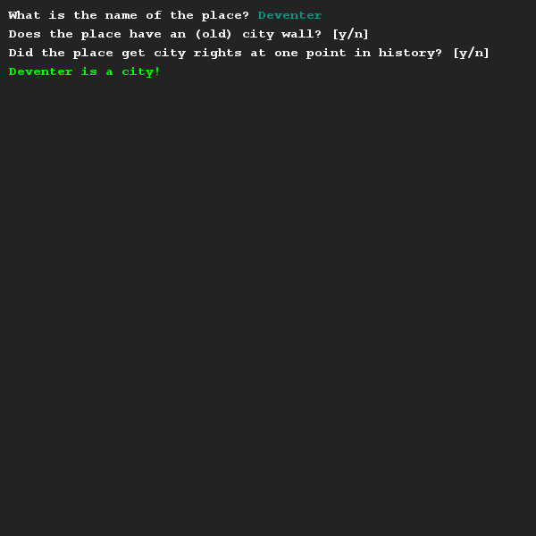
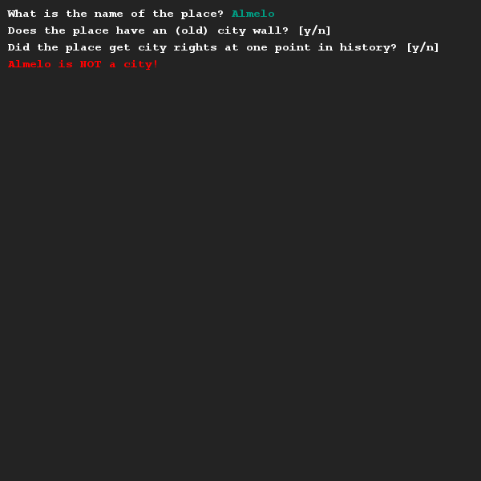

# Code herschrijven met boolean logic 2
## Moeilijkheid:    

Kopieer de code hieronder en plak dit in de oefening. Kijk wat het programma doet als je het runt.
```Java
SaxionApp.print("What is the name of the place? ");
String name = SaxionApp.readString();

SaxionApp.printLine("Does the place have an (old) city wall? [y/n] ");
boolean hasCityWall = SaxionApp.readChar() == 'y';

SaxionApp.printLine("Did the place get city rights at one point in history? [y/n] ");
boolean hasCityRights = SaxionApp.readChar() == 'y';

if (name.equals("Enschede")) {
    SaxionApp.print(name + " is a city!", Color.GREEN);
} else if (name.equals("Deventer")) {
    SaxionApp.print(name + " is a city!", Color.GREEN);
} else if (hasCityWall && hasCityRights) {
    SaxionApp.print(name + " is a city!", Color.GREEN);
} else {
    SaxionApp.print(name + " is NOT a city!", Color.RED);
}
```
Het valt je misschien op dat de code meerdere "duplicate lines" (dubbele regels) heeft. Tijdens het programmeren proberen we duplicate lines zoveel mogelijk te voorkomen.

Zorg dat de duplicate lines uit het programma gehaald worden door het gebruik van boolean logic. Let op dat je programma precies doet wat het voorbeeld programma doet!

## Voorbeeld




## Relevante links
* [Java documentatie van de SaxionApp](https://saxionapp.hboictlab.nl/nl/saxion/app/SaxionApp.html)
