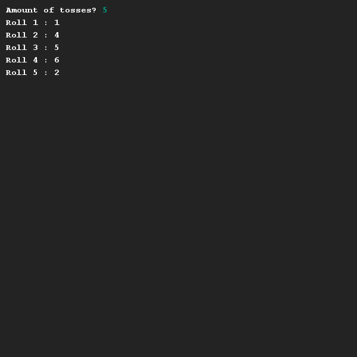

# Gooien van dobbelstenen
## Moeilijkheid:    

Schrijf een stuk code wat het werpen van een dobbelsteen nadoet. Eerst wordt gevraagd hoeveel worpen je wil doen en vervolgens wordt per worp getoond wat het resultaat van deze worp is.

## Voorbeeld

## Relevante links
* [Java documentatie van de SaxionApp](https://saxionapp.hboictlab.nl/nl/saxion/app/SaxionApp.html)
