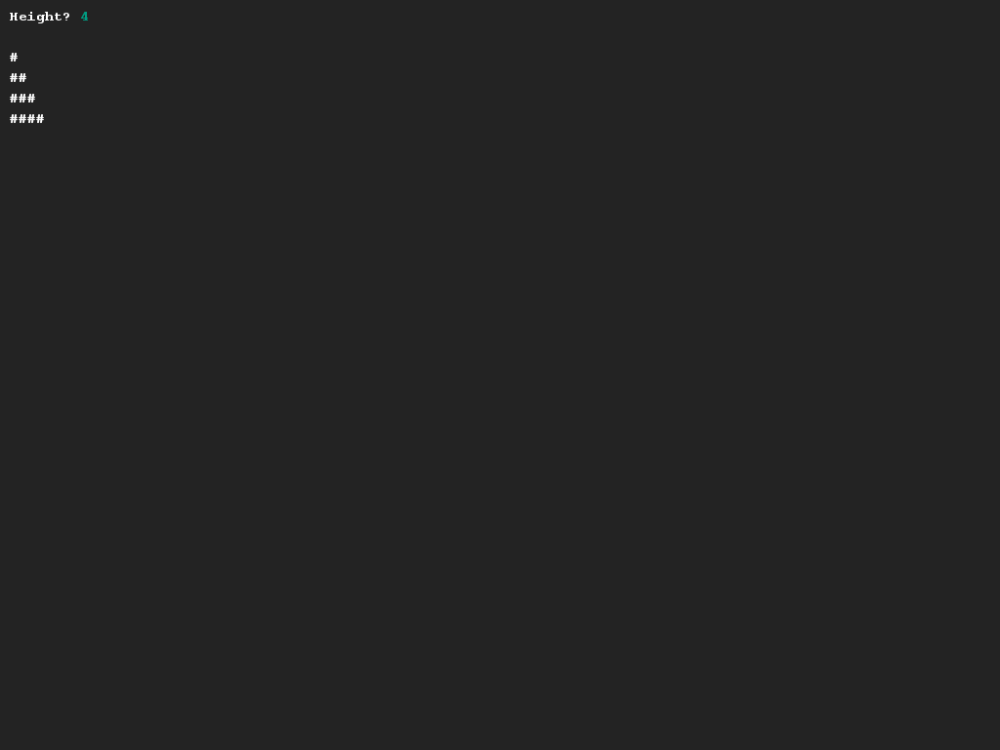
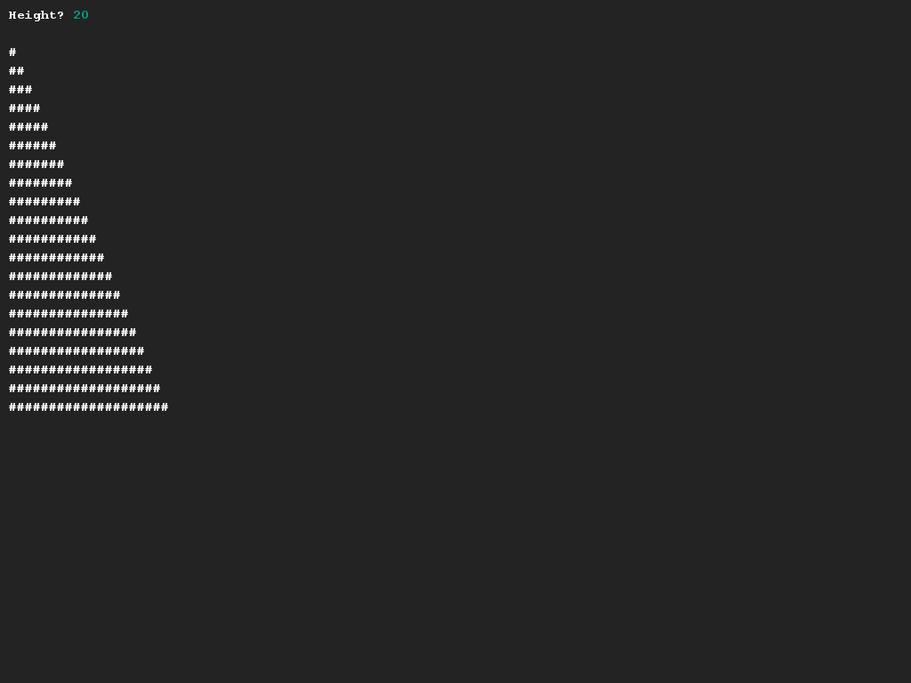

# Drawing (half of) a pyramid
## Difficulty:    

Create a program that draws the right side of a pyramid, based on the height that can be entered by the user.

## Example

## Relevant links
* [Java documentation of the SaxionApp](https://saxionapp.hboictlab.nl/nl/saxion/app/SaxionApp.html)
