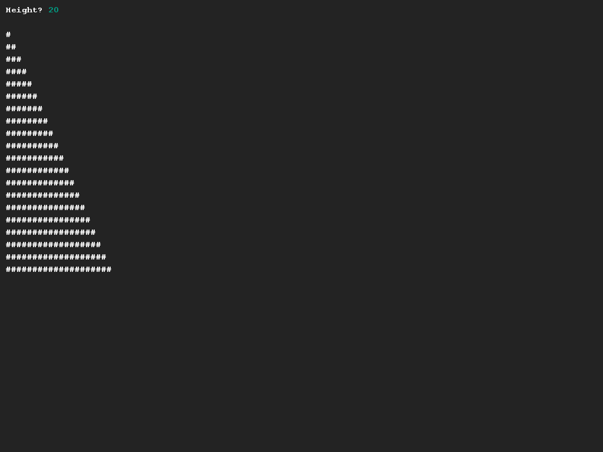

# Een (halve) pyramide tekenen
## Moeilijkheid:    

Schrijf een programma waarmee je de rechterkant van een pyramide kan tekenen, gebaseerd op de hoogte die door de gebruiker kan worden ingegeven.

## Voorbeeld

## Relevante links
* [Java documentatie van de SaxionApp](https://saxionapp.hboictlab.nl/nl/saxion/app/SaxionApp.html)

