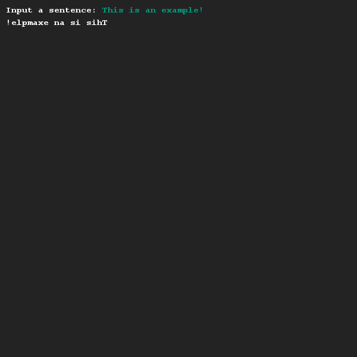

# Reversing a String
## Difficulty:    

Create a program that prints out the contents of a String variable, that was entered by the user, in reverse.

Note that you need to have a look at [String.charAt(..)](https://docs.oracle.com/javase/9/docs/api/java/lang/String.html#charAt-int-) method from the String class to do so!

## Example

## Relevant links
* [Java documentation of the SaxionApp](https://saxionapp.hboictlab.nl/nl/saxion/app/SaxionApp.html)
* [Java String class](https://docs.oracle.com/javase/9/docs/api/java/lang/String.html)

