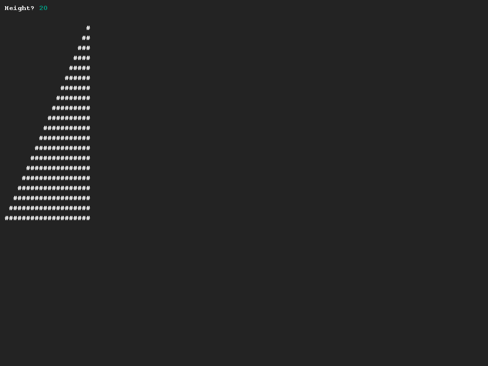

# Drawing (half of) a pyramid
## Difficulty:    

Create a program that draws the **left** side of a pyramid, based on the height that can be entered by the user.

Hint: If you get stuck, try drawing the pyramid on a paper that has a grid on it.

## Example

## Relevant links
* [Java documentation of the SaxionApp](https://saxionapp.hboictlab.nl/nl/saxion/app/SaxionApp.html)

