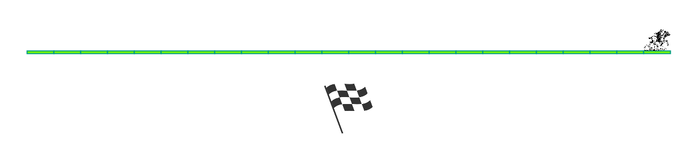

# Horse racing
## Difficulty:    

Create a program that simulates a horse race. In this example, there is only one horse and it needs to travel a predefined distance of 25 _steps_ (of 50 pixels each) on the field.

The program should work with rounds, meaning that the image is updated after each round to show the position of the horse. Each round, the horse can travel a random amount of 1 to 4 _steps_. After the race is over, a finish flag should be displayed.

You can use the SaxionApp method _pause()_ to wait for user input before moving to the next round.

## Example

(Note this is a gif that helps you understand how the program is built!)

## Relevant links
* [Java documentation of the SaxionApp](https://saxionapp.hboictlab.nl/nl/saxion/app/SaxionApp.html)
