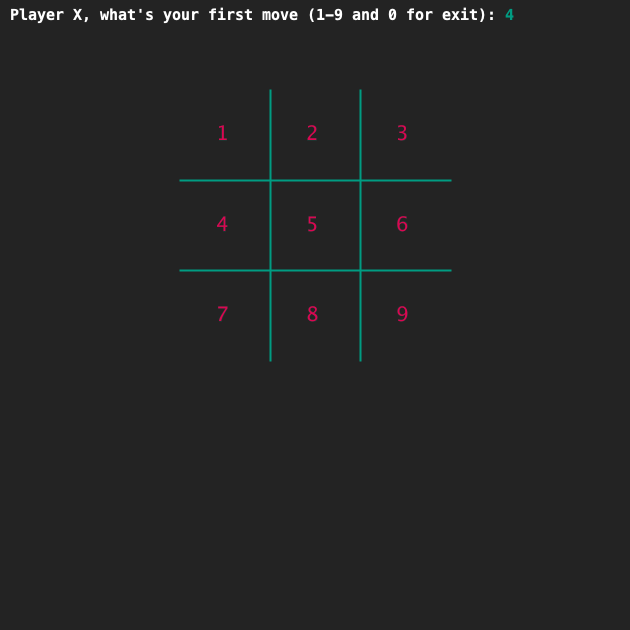
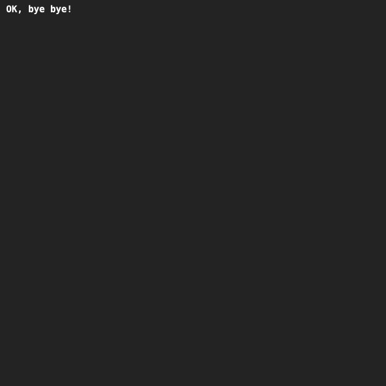

# Boter-kaas-en-eieren met while-loop
## Moeilijkheid:   

En weer verder met Boter-kaas-en-eieren.

Het programma print nu een bord en vraagt de speler om de eerste zet te doen.
We hebben nu veel gekopieerde code en de speler kan maar één zet doen.
Dat moet natuurlijk beter. We gaan nu de applicatie zo uitbouwen dat er meerdere zetten kunnen worden gedaan, totdat een speler zet '0' invoert.
We zijn nog niet zo ver dat we kunnen gaan controleren of iemand gewonnen heeft.  

Je kunt voor deze opdracht jouw eigen code gebruiken of starten vanaf de voorbeeldcode die bij de laatste oefening is aangeleverd.

Zet de doen van zetten in een while-loop. Je moet goed opletten welke code je binnen en buiten de loop zet.
- De speler wordt gevraagd de EERSTE zet te doen,
- De speler voert een zet in. 
- Als de invoer een getal is tussen 1 en 9, zal de zet worden uitgevoerd en het nieuwe bord getoond en de speler wordt gevraagd naar z'n VOLGENDE zet.
- Dit gaat door tot de invoer 0 is.
- Als de invoer 0 is, wordt het scherm schoongeveegd en verschijnt een afscheidsboodschap.
In deze oefening werk je alleen met spelerX. We gaan dus het bord vullen met X-en.

## Voorbeeld

Na een aantal zetten:

De afscheidsboodschap:

## Relevante links
* [Java documentatie van de SaxionApp](https://saxionapp.hboictlab.nl/nl/saxion/app/SaxionApp.html)