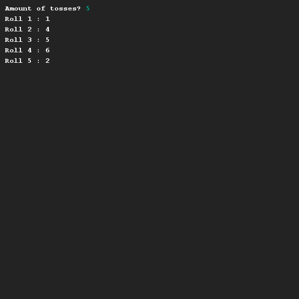

# Throwing a die
## Difficulty:    

Write a program that simulates throwing of a dice. Initially you are asked to enter the number of throws. Next, each throw including the result is displayed.

## Example

## Relevant links
* [Java documentation of the SaxionApp](https://saxionapp.hboictlab.nl/nl/saxion/app/SaxionApp.html)
