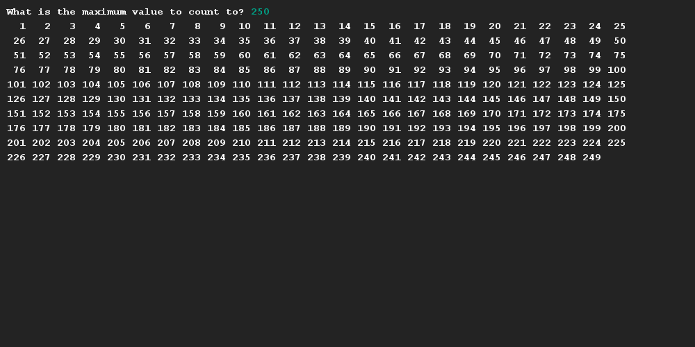

# Printing formatted numbers
## Difficulty:    

To properly display a large amount of values, it is common to line-wrap them. Line-wrapping is basically hitting the return-key every now and then.

Create a program that prints out a number of values, starting at 1 at reaching to a user specified maximum, that wraps these numbers after each 25th number that is printed.

(_Note:_ To help with the layout we have used the method [_String.format(..)_](https://www.javatpoint.com/java-string-format) to print out each integer value with additional whitespaces. An example of this can be found in the code.)

## Example

## Relevant links
* [Java documentation of the SaxionApp](https://saxionapp.hboictlab.nl/nl/saxion/app/SaxionApp.html)
* [String formatting](https://www.javatpoint.com/java-string-format)

