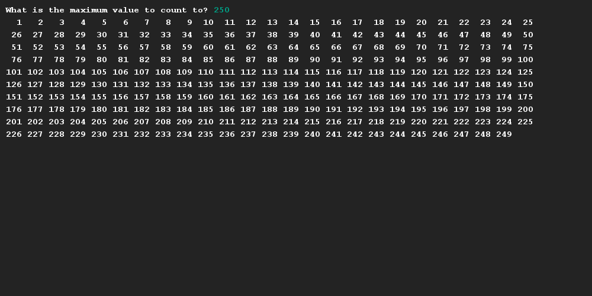

# Getallen printen met opmaak
## Moeilijkheid:    

Om een groot aantal waarden te printen wordt er in de meeste programma's gebruik gemaakt van _line wrapping_. _Line wrapping_ is eigenlijk niets anders dan af en toe een enter zetten achter een zin (zodat deze in het scherm blfijt).

Schrijf een programma waarin de gebruiker een waarde mag opgeven en dat alle waarden tussen 1 en de opgegeven waarde worden uitgeprint, waarbij na elke 25 getallen een enter wordt geplaatst.

(_Let op:_ Om er voor te zorgen dat de getallen ongeveer even breed zijn hebben wij in onderstaande afbeelding de methode [_String.format(..)_](https://www.javatpoint.com/java-string-format) gebruikt om elke waarde even breed te maken (aan te vullen met spaties indien nodig). In de code hebben wij een voorbeeld opgenomen hoe je dit ook zelf kan doen.)

## Voorbeeld

## Relevante links
* [Java documentatie van de SaxionApp](https://saxionapp.hboictlab.nl/nl/saxion/app/SaxionApp.html)
* [String format](https://www.javatpoint.com/java-string-format)
