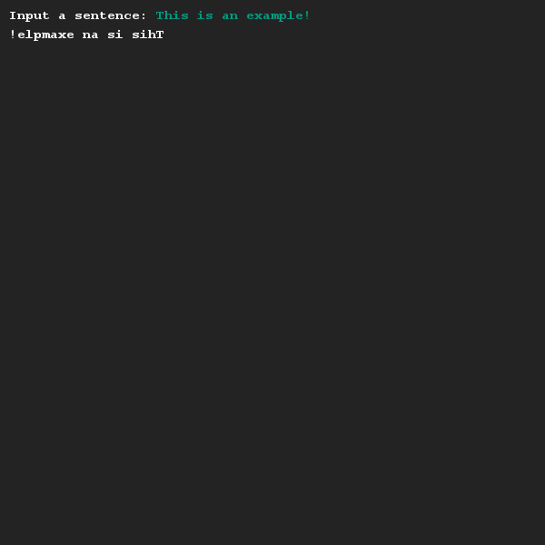

# Een (halve) pyramide tekenen
## Moeilijkheid:    

Schrijf een programma waarmee een String variabele omgedraaid wordt uitgeprint.

Je dient hiervoor gebruik te maken van de [String.charAt(..)](https://docs.oracle.com/javase/9/docs/api/java/lang/String.html#charAt-int-) methode die in de String klasse te vinden is.

## Voorbeeld

## Relevante links
* [Java documentatie van de SaxionApp](https://saxionapp.hboictlab.nl/nl/saxion/app/SaxionApp.html)
* [Java String klasse](https://docs.oracle.com/javase/9/docs/api/java/lang/String.html)

