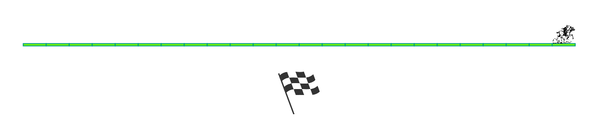

# Paardenrace
## Moeilijkheid:    

Schrijf een programma waarmee je een paardenrace kan simuleren. In dit voorbeeld is er slechts 1 paard en deze moet een afstand van 25 _stappen_ afleggen (waarbij 1 stap 50 pixels is).

Het programma dient met ronden te werken, waarbij na elke ronde de afbeelding geupdate moet worden om de positie van het paard te tonen. Elke ronde kan het paard 1 tot maximaal 4 stappen tegelijkertijd afleggen. Zodra de race is afgelopen moet er een finish-vlag getoond worden.

Je kan de SaxionApp methode _pause()_ gebruiken om te wachten voor een volgende beurt. Ook kan je de methode _clear()_ gebruiken om het scherm weer leeg te maken om zo een nieuwe afbeelding te kunnen tekenen.

## Voorbeeld

(Let op, dit is een gifje wat je kan gebruiken om te zien hoe het programma is opgebouwd!)

## Relevante links
* [Java documentation of the SaxionApp](https://saxionapp.hboictlab.nl/nl/saxion/app/SaxionApp.html)
