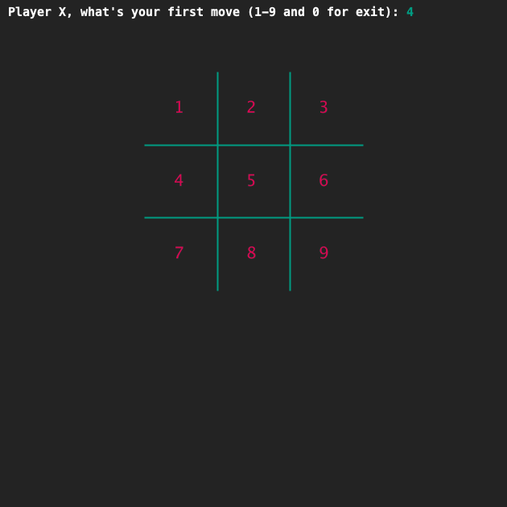
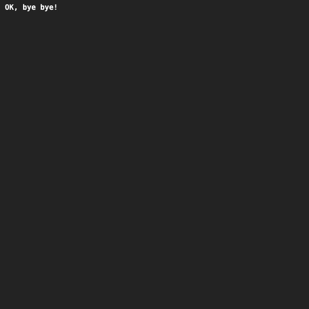

# TicTacToe using while-loop
## Difficulty:    
And on we go with TicTacToe

The program so far prints a game board and asks the player to make the first move.
We now have a lot of copied code and the player can only make one move.
We can improve that with the knowledge we have now. We are going to expand the application in such a way that multiple moves can be made, until a player enters '0'.
We are not ready yet to check if someone has won.

You can use your own code for this assignment or start from the sample code supplied with the last exercise.

Put the moves in a while loop. You have to select carefully which code you put inside and outside the loop.
- The player is asked to make the FIRST move,
- The player makes a move.
- If the input is a number between 1 and 9, the move will be made and the new board will be displayed and the player will be prompted for his NEXT move.
- This goes on until the input is 0.
- If the input is 0, the screen will be wiped and a goodbye message will appear.
In this exercise you will only work with playerX. So we're going to fill the board with X's.

## Example
## Voorbeeld

Na een aantal zetten:

De afscheidsboodschap:

## Relevant links
* [Java documentation of the SaxionApp](https://saxionapp.hboictlab.nl/nl/saxion/app/SaxionApp.html)