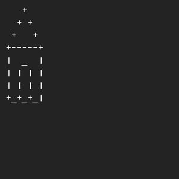

# Drawing a house
## Difficulty:    

Draw a simple house in SaxionApp using basic characters.

## Example

## Relevant links
* [Java documentation of the SaxionApp](https://saxionapp.hboictlab.nl/nl/saxion/app/SaxionApp.html)