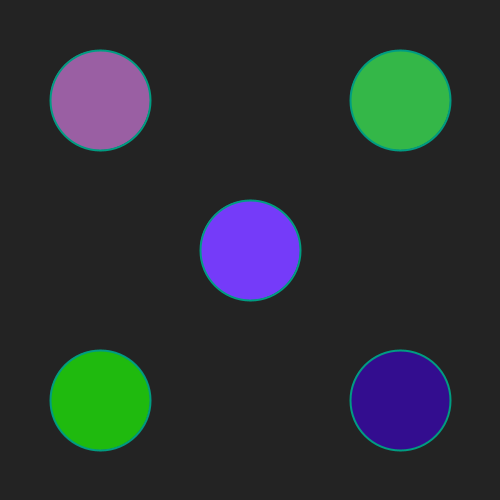

# Met kleuren werken
## Moeilijkheid:    

Met de SaxionApp kan je ook tijdens het werken met figuren van kleur wisselen. Maak onderstaande afbeelding waarbij elke cirkel een andere kleur heeft.

Probeer ook eens de `getRandomColor()` methode van SaxionApp te gebruiken.

## Voorbeeld

## Relevante links
* [Java documentatie van de SaxionApp](https://saxionapp.hboictlab.nl/nl/saxion/app/SaxionApp.html)