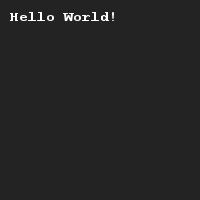

# Hello World!
## Difficulty:    

One of the first things you'll learn when learning a new programming language is how to create a program called _Hello World_. This has become a tradition that we won't dare to break.

Create a program that prints out the message _"Hello World!"_.

## Example

## Relevant links
* [Java documentation of the SaxionApp](https://saxionapp.hboictlab.nl/nl/saxion/app/SaxionApp.html)