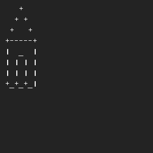

# Een huis tekenen
## Moeilijkheid:    

Teken een primitief huisje met basis-tekens op je toetsenbord.

## Voorbeeld

## Relevante links
* [Java documentatie van de SaxionApp](https://saxionapp.hboictlab.nl/nl/saxion/app/SaxionApp.html)