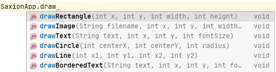
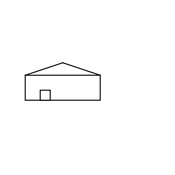

# Een "mooiere" schuur tekenen
## Moeilijkheid:    

Teken de schuur zoals in onderstaand voorbeeld. De afmetingen mogen afwijken.

Let er op dat je bij deze opdracht ook wat met de kleuren zal moeten aanpassen. Dit kan je ook via de SaxionApp doen.

_Hint:_ Bekijk vooral ook eens wat er gebeurd als je een gedeelte van de methodenaam intypt (zie plaatje hieronder)

## Voorbeeld

## Relevante links
* [Java documentatie van de SaxionApp](https://saxionapp.hboictlab.nl/nl/saxion/app/SaxionApp.html)