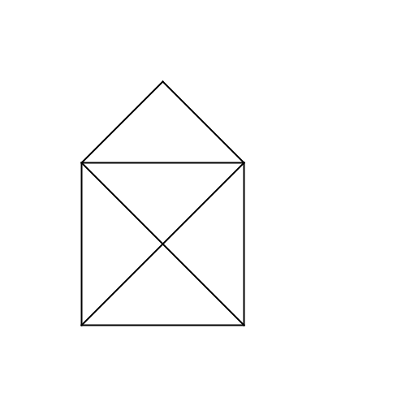

# Drawing in steps
## Difficulty:    

Using the `pause()` method, you can save separate steps while drawing. Draw a "one-line-house" as shown in the example, saving each individual step. At the end, save an actual image file of your drawing using the `saveImage()` method. (Note that your applications actually run from a different folder than where you are working in. So to save an image to this Exercise5 file, you'll need to type `saveImage("Exercise5/my-output.png")`).

## Example

## Relevant links
* [Java documentation of the SaxionApp](https://saxionapp.hboictlab.nl/nl/saxion/app/SaxionApp.html)