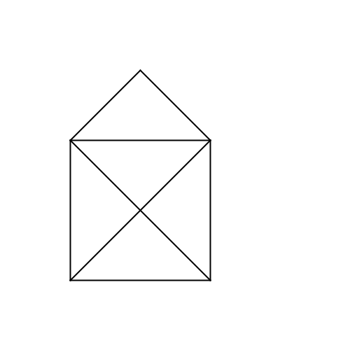

# Tekenen in stappen
## Moeilijkheid:    

Door gebruik te maken van de `pause()`-methode kan je stappen individueel laten opslaan zodat je deze later kan doorlopen. Bouw onderstaande huisje door individuele lijnen te trekken, maar zorg er voor dat je applicatie deze stap voor stap kan opbouwen.

Sla vervolgens je afbeelding op door de `saveImage()` methode aan te roepen. Let er op dat de map waarin je programma wordt uitgevoerd niet helemaal overeenkomt met wat je zou verwachten. Je moet dus vooral even de mapnaam van deze opdracht opnemen in het commando (dus bijv: `saveImage("Exercise5/my-output.png")`).

## Voorbeeld

## Relevante links
* [Java documentatie van de SaxionApp](https://saxionapp.hboictlab.nl/nl/saxion/app/SaxionApp.html)

