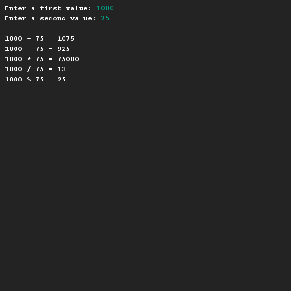

# Eenvoudige berekeningen maken
## Moeilijkheid:    

Schrijf een programma dat om twee getallen vraagt en hier wat eenvoudige berekeningen mee uitvoert. Probeer alle operaties en zorg er voor dat je snapt wat de ```%``` operatie doet. Probeer ook het resultaat van de `/` operator te beschrijven.

## Voorbeeld


## Relevante links
* [Java documentatie van de SaxionApp](https://saxionapp.hboictlab.nl/nl/saxion/app/SaxionApp.html)


