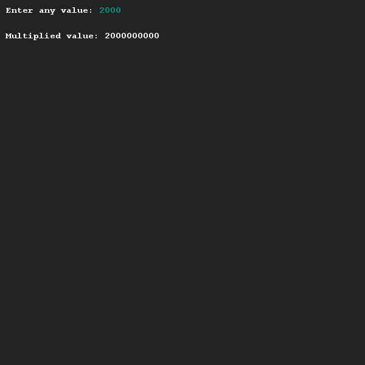

# Grenzen opzoeken
## Moeilijkheid:    

Variabelen kunnen niet zomaar oneindige waarden opslaan, maar kennen ook limieten. In deze opdracht gaan wij op zoek naar de limiet van het integer datatype.

Schrijf een programma waarmee je een integer waarde kan invoeren. Print deze waarde vervolgens weer uit, maar niet voordat je hem vermenigvuldigd hebt met 1,000,000 (1 miljoen). Zodra je deze applicatie hebt geschreven, probeer hem dan uit met de volgende waarden:
* 2000
* 2100
* 3000

Probeer door nu verder te experimenteren uit te zoeken wat de maximale waarde is van een integer variabele (en probeer te verklaren wat je ziet gebeuren).

## Voorbeeld

## Relevante links
* [Java documentatie van de SaxionApp](https://saxionapp.hboictlab.nl/nl/saxion/app/SaxionApp.html)

